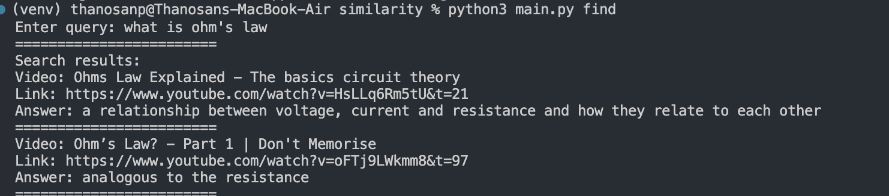

# TutorialTube

## Purpose
TutorialTube is a simple search engine that searches for videos within a database of videos.

Companies have a lot of useful information in their video calls. Using this terminal application, companies can put their recorded video calls (in the form of YouTube videos) into a database and use the database to query for information.
 
## How to use it

First, clone the repository.

To add a video into the database, run:
```bash
python3 main.py add
```

To query the database of videos, run:
```bash
python3 main.py find
```

## How does it work?
This search engine uses cosine similarity to find the best possible video for the given query.

For transcribing the video, OpenAI's Whisper model is used. For question answering, Facebook's RoBERTa is used. 

